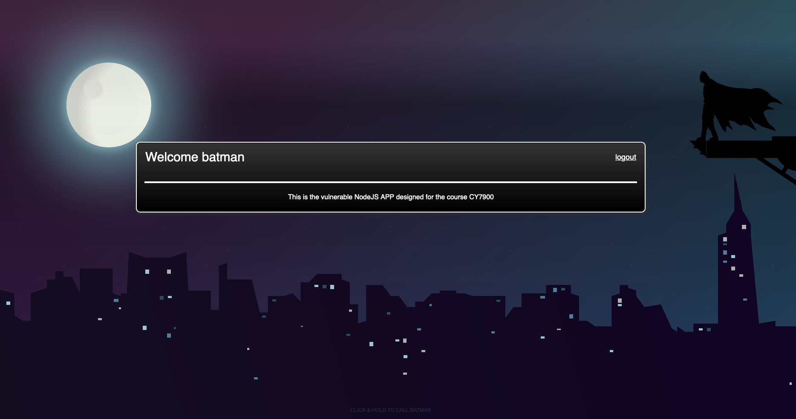

# vuln-web-app
This is a fictitious app which is vulnerable and part of the Capstone project for CY7900-2023 spring.

Machine requirements:

```bash
Node: v18.11.0
npm: v8.19.2
pm2: 5.2.2

# The versions can change depending on the time of implementation
```

Dependencies:

```json
    "dependencies": {
      "jsonwebtoken": "^0.4.0",
      "morgan": "^1.10.0",
      "some-private-package": "^1.0.0"
    },
```

## About the APP

The web-app is being used by Batman to share messages with his trusted companions i.e., CY Capstone Team 1.

This is how the login screen looks like:


This is how the authenticated screen looks like: 



### The app is built vulnerable intentionally.

We are using `jsonwebtoken v0.4.0` which is known to be vulnerable to token signing vulnerability ([CVE-2015-9235](https://nvd.nist.gov/vuln/detail/CVE-2015-9235)) and will allow us to do account takeovers.

```diff 
- Critical issue 1 (Account Takeover)
+ CVSS: 3.0/AV:N/AC:L/PR:N/UI:N/S:U/C:H/I:H/A:H
```

> **Note**  
> STEP1: This will allows us to do perform an account takeover of the admin account, from here we will leak about the source code and name of a private package called: \<private-package-name>

We will also be using an internal package managing service like NPM, [Verdaccio](https://www.npmjs.com/package/verdaccio) to pull our private packages from.


> When the attack will unfold, the dependency would be downloaded from the general [NPM registry](https://www.npmjs.com/)

```diff 
- High/Critical issue 2
+ CVSS:3.1/AV:N/AC:L/PR:N/UI:R/S:U/C:H/I:H/A:H
# depends based on the amount of compromise a company incurs 
```

> **Note**  
> STEP2: This will allows us to get back a call back over the DNS and/or HTTP requests.

## Installation

Once you have the dummy users list, using the python file, generate the JSON DB. (It will be generated in `./datebase/users.json`)

```bash
python3 generate_db.py -filename <users>.txt
```

Once the DB is generated, install the dependencies and start the server.

```bash
# install dependencies (make sure you are in the root directory)
npm install

# start the server
npm start
```
Make sure to create the ENV file (.env). The .env file should look something like this:

```env
# contents of .env file
PORT=1337
```

## Running it on a VPS

Install pm2 node-package.

```bash
# PM2 is a production process manager for Node.js applications with a built-in load balancer. It allows you to keep applications alive forever, to reload them without downtime and to facilitate common system admin tasks.

npm i pm2
```

To run the server, issue the command:

```bash
pm2 start src/app.js
```

---

## Credits

Coming soon!
